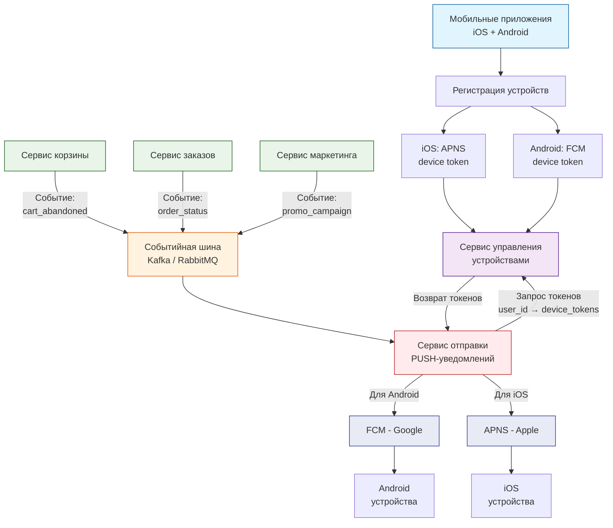

# Задание 3: Архитектура PUSH-уведомлений

## Архитектурная схема

    
## Компоненты системы

### 1. Источники событий (Бизнес-микросервисы)
- **Сервис корзины**: Генерирует события о брошенных корзинах (например, `cart_abandoned` после 30 минут бездействия)
- **Сервис заказов**: Генерирует события об изменении статуса заказа (`order_created`, `order_cancelled`, `order_delivered`)
- **Сервис маркетинга**: Генерирует события для рекламных рассылок (`promo_started`, `personal_offer`)

### 2. Событийная шина (Message Queue)
- **Назначение**: Асинхронная и надежная передача событий между микросервисами
- **Выбор технологии** (зависит от требований):
  - **Kafka** — предпочтительнее при высоких нагрузках, необходимости хранения истории событий и наличии нескольких потребителей одних и тех же данных
  - **RabbitMQ** — проще в настройке, лучше подходит для гарантированной доставки транзакционных сообщений

### 3. Сервис отправки PUSH-уведомлений
- Потребляет события из шины
- Определяет тип уведомления и выбирает соответствующий шаблон сообщения
- Запрашивает актуальные токены устройств пользователя через Сервис управления устройствами
- Формирует и отправляет уведомления через соответствующие шлюзы:
  - **FCM (Firebase Cloud Messaging)** для Android-устройств
  - **APNS (Apple Push Notification Service)** для iOS-устройств
- Реализует retry-логику при временных сбоях доставки
- Логирует результаты отправки для мониторинга и аналитики

### 4. Сервис управления устройствами
- Хранит актуальные токены устройств (`device_token`), полученные от мобильных приложений
- Поддерживает соответствие `user_id → [device_token, platform, last_active]`
- Очищает неактуальные токены (при переустановке приложения, смене устройства и т.д.)

## Пример потока данных: "Напоминание о брошенной корзине"

1. **Генерация события**: Пользователь добавляет товары в корзину и уходит. Через 30 минут Сервис корзины обнаруживает неоформленную корзину и публикует событие `cart_abandoned` в шину.
   
2. **Передача события**: Событийная шина (Kafka/RabbitMQ) доставляет событие всем подписчикам, включая Сервис отправки PUSH.

3. **Обработка события**: Сервис отправки PUSH:
   - Читает событие из шины
   - Определяет, что это событие типа "cart_abandoned"
   - Выбирает шаблон сообщения: "Не забудьте о корзине! Товары: {список_товаров}"
   - Запрашивает в Сервисе управления устройствами токены всех устройств пользователя

4. **Отправка уведомления**: Для каждого device token:
   - Если платформа Android → отправляет через FCM API
   - Если платформа iOS → отправляет через APNS API

5. **Доставка пользователю**: FCM/APNS доставляют уведомление на устройство пользователя.

## Типы уведомлений (соответствуют примерам из ТЗ)

- **Напоминания о брошенной корзине** — "Ваш заказ ждет оформления!"
- **Статусы заказов** — "Заказ №12345 отменен", "Ваш заказ доставлен"
- **Рекламные рассылки** — "Скидка 20% на свежие овощи до конца недели!"
- **Системные уведомления** — "Доставка задерживается на 30 минут"

## Преимущества предложенной архитектуры

1. **Масштабируемость**: Каждый компонент (сервисы, шина) масштабируется независимо. Например, при росте числа уведомлений можно увеличить количество инстансов Сервиса отправки.

2. **Надежность**: Асинхронная обработка через шину событий обеспечивает отказоустойчивость. Если Сервис отправки временно недоступен, события накапливаются в шине и будут обработаны после восстановления.

3. **Гибкость**: Легко добавить новые типы уведомлений (достаточно добавить новый тип события) или новые источники событий (новый микросервис).

4. **Соответствие ТЗ**: Архитектура:
   - Работает в **микросервисной среде** (каждый компонент — отдельный сервис)
   - Поддерживает **все указанные типы уведомлений** из задания
   - Позволяет **легко добавлять новые** виды PUSH-уведомлений по мере появления бизнес-потребностей

5. **Разделение ответственности**: Каждый сервис отвечает за свою зону:
   - Бизнес-сервисы — генерируют события
   - Шина — транспортировка событий
   - Сервис отправки — преобразование событий в уведомления
   - Сервис устройств — управление данными устройств

## Уточняющие вопросы для реализации

1. **По выбору Message Queue**: "Какие ожидаются объемы уведомлений (сообщений/секунду)? Нужна ли возможность повторно читать историю событий для аналитики или отладки?"
   
2. **По стратегии отправки**: "Нужна ли поддержка разных приоритетов уведомлений (немедленная отправка vs. экономичный режим)? Требуется ли A/B-тестирование текстов уведомлений?"

3. **По управлению подписками**: "Должны ли пользователи иметь возможность тонко настраивать типы получаемых уведомлений (например, получать уведомления о заказах, но не о рекламных акциях)?"
